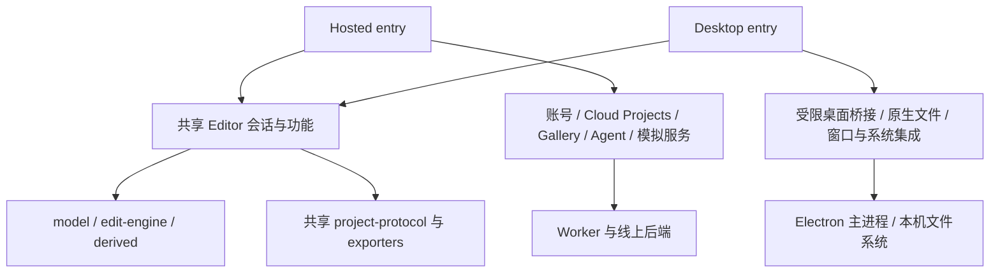

# 目标架构：一条主线，两个宿主，共用编辑和文件协议

拟定的目标是：**同一个仓库和 main，Web 与 desktop 分别装配、测试、发布；model、edit-engine、派生计算、编辑界面和正式文件协议共用。** 这是准备阶段的架构建议，以下目录、接口和发行方式属于待实现设计，不表示产品已完成解耦或讨论参与者已共同确认。首批范围以[首版本地合并计划](05-local-merge-plan.md)为准，正式发行留待讨论。

## 1. 仓库和应用边界

保留现有 monorepo。在线后端继续由 `worker/` 及模拟服务拥有；新增 `apps/desktop/` 承载 Electron 主进程、受限桥接和 Windows 打包。第一阶段不另发版本化核心 npm 包，也不建立长期 desktop 分支。

```text
packages/
  model, project-protocol          共用事实与文件边界
  edit-engine, derived             共用事务、连接、几何
  components, symbols, devices     共用器件定义和生成产物
  render-svg, exporters, visio     共用导出（Visio 待迁入）
  spice, netlist                   共用结构网表能力

apps/editor/src/
  entries/hosted.tsx               待新增：装配线上能力
  entries/desktop.tsx              待新增：装配本地能力
  app/                            共用编辑会话和 UI 组合
  document/                       共用文档/工作区/保存协调
  hosts/                          待新增：宿主接口及实现
  features/, canvas/              共用功能、交互、绘制

apps/desktop/                     待新增：系统窗口、文件、安装和安全策略
apps/local-host/                  保留现有用途，避免复制成第二套编辑器
worker/, containers/              线上服务及模拟执行
```

这是渐进式抽离，不要求先搬迁全部 `apps/editor`，也不创建通用插件加载器。两个入口必须导向同一个编辑器实现，不能各复制一个 App。



## 2. 只抽已经证明需要的接口

| 边界         | 共用部分                                                            | Hosted 实现                                  | Desktop 实现                                             |
| ------------ | ------------------------------------------------------------------- | -------------------------------------------- | -------------------------------------------------------- |
| Project 保存 | 生成一致快照、先提交文本草稿、dirty/保存中/失败状态、保存后版本核对 | CloudProjectStore，保留 id/revision/conflict | NativeProjectStore，授权句柄、原子文件写入、外部修改检测 |
| 打开与导出   | parse/validate/normalize、序列化、网表和图形生成                    | 浏览器 File/Download                         | 原生对话框与文件交付                                     |
| 恢复与工作区 | 多标签页 Project 身份、视图、草稿、安全快照规则                     | 浏览器 origin 范围的 IndexedDB/session 状态  | 桌面应用数据范围的 IndexedDB/本地恢复存储                |
| 账号/云/图库 | 独立业务模块提供 UI 和命令                                          | 装配真实服务                                 | 严格离线产物不装配                                       |
| Agent        | 共用 typed transaction，独立授权和 transport                        | 保留现有 Agent 会话                          | 首版不可用；未来本地接入单独设计，不以登录状态推导       |
| 模拟         | 共用输入准备和结果契约                                              | 现有 managed 服务                            | 首版不可用；将来本地执行适配器另定模型/资源边界          |
| 系统动作     | 功能表达“打开帮助/退出/导出”意图                                    | 浏览器实现                                   | 窗口、关联、菜单、离线帮助                               |

接口传入明确依赖，避免散落 `window.location.protocol === 'app:'`、`isDesktop` 和登录判断。React 服务的订阅和 hook 在各宿主的组合组件中管理；隐藏一个按钮不能代替停止服务初始化。

### 保存结果不能抹平

建议把保存绑定保留为有类型的分支，例如：

```ts
// 接口方向示例；正式类型需在实现目标中确认。
type ProjectBinding =
  | { kind: "cloud"; projectId: string; revision: number }
  | { kind: "native-file"; handleId: string; displayName: string };
```

`handleId` 是主进程控制的授权句柄，不是 renderer 任意给出的绝对路径。云冲突和本地磁盘冲突可共享上层状态，但各自携带足够的恢复信息。不能为了统一接口而默默丢掉 cloud revision 或把浏览器 download-requested 当成已持久化保存。

统一由保存协调器检查：提交时的 Project/标签页身份，保存期间是否又产生了新编辑，异步完成是否仍对应原来的会话。保存旧快照完成不能把新编辑标为 clean。

### 有两个保存目标时必须明确

- Web 当前默认 Save 继续是 Cloud Save，便携导出仍是独立操作。
- Desktop 首版默认 Save 是本地文件。
- 若以后 desktop 支持联网，把“上传/另存到云”作为明确动作；不根据账号是否登录自动切换 Ctrl+S 的目的地。
- Cloud id/revision、本地 handle/path 不进入跨平台的电路事实；它们属于宿主/工作区绑定。Recovery 与正式保存保持不同生命周期。

## 3. 功能和格式共用规则

Properties 表单、色板、粗网格、Visio、跳线等使用同一份实现，入口可以先仅在 Desktop 开放，不要求两端同时发布所有功能。涉及持久化字段时，同一代协议的 Web 仍须正确读取、显示和再保存。具体差异边界见 [功能分叉的保留与共用](04-feature-sharing.md)。图形输入、JSON 输入和 Agent 均通过相同事务/验证规则，不能各有一条直接改模型的路径。

官方 Web/desktop 使用同一个 `project-protocol` 编解码器；同一代码版本写出的项目能在两端无损交换。不同发行版本仍遵守已有历史迁移/未来版本拒绝规则，不承诺旧桌面版可打开任意未来网页文件。

Schema 策略：

1. 产品版本、内存模型版本、portable 文件版本独立管理。
2. 官方功能进入主线时，由该功能的实现目标统一修改 schema/codec/迁移；不能照搬 fork 的 58/59/60 数字。
3. 已有 `.schdraft` 通过明确的 Schematic Draft 导入入口和独立 reader 读取，再转换到当前主线模型。扩展名只是 UI 提示，不是充分的格式证明。
4. 对无法辨别来源的旧 JSON 不猜来源，也不删除未知字段来让验证通过；需要用户明确来源或给出可验证的标识。
5. 新的独立 fork 文件可使用自己的格式标识/版本空间。主项目是否采用新的公共 envelope，应另有兼容性目标，不能为此次迁入随意破坏现有文件。
6. 转换需保留原始输入，列明不支持的器件/样式/字段。未实现无损转换时拒绝或要求明确接受损失，不能静默丢失。

这条规则同时解决“格式号碰撞”和“同版本同数字被错误解释”；单纯规定以后谁分配版本号不足以处理已有文件。

## 4. 构建与网络策略

最终部署架构建议保留两个产品目标；安装包与 Release 不在首批本地实现范围内：

| 目标              | 包含的能力                           | 产物/目的地                                  |
| ----------------- | ------------------------------------ | -------------------------------------------- |
| `web-hosted`      | 共用编辑器 + 在线服务装配            | Worker/静态资源 → 现有 Production            |
| `desktop-offline` | 共用编辑器 + 本机文件 + 离线系统能力 | Windows 安装 EXE 与便携 ZIP → GitHub Release |

EXE 和 ZIP 是同一个桌面目标的两种包装，不是两套核心代码。暂不增加独立的联网 desktop 产品；架构允许将来新增 `desktop-connected` 装配，但要另行确认身份、保存目的地、云同步和发布策略。

`desktop-offline` 必须从构建入口上不装配云服务和自动更新等联网业务；构建扫描/模块图检验不能只看 UI 是否隐藏。宿主再对 Chromium 请求、导航、新窗口、权限、外部链接等施加策略；主进程/子进程只提供必要能力。以实际产物网络验证支撑离线声明，不能用源码字符串扫描代替。

在线桌面模式若未来存在，登录只表示身份，不表示已授权传输当前本地项目。严格离线发行包不能靠一个普通运行时开关转为联网产品。

`apps/local-host` 继续保留；首版 Electron 使用 `app://` 本地资源和受限桥接。需要模拟器时再选择本地执行适配器，不把现有云模拟初始化藏在不可见 UI 后面。

## 5. GitHub 管理和发布

| 项目         | 建议                                                                                       |
| ------------ | ------------------------------------------------------------------------------------------ |
| 主仓库       | 继续使用 `cascode-ai/analog-canvas` monorepo                                               |
| 开发         | 短期功能分支、逐目标提交与 PR，继续当前 merge queue                                        |
| desktop 维护 | 独立模块负责人；共同核心仍由主线契约负责，不另建长期产品分支                               |
| 引入对方工作 | 以主线为底座按功能适配；记录来源仓库、commit 和 attribution，保留适用许可证信息            |
| Web 发布     | 保持现有 `main` 非文档合并 → Production → 验证/回滚                                        |
| Desktop 发布 | 从已在 main 的固定提交创建 `desktop-vX.Y.Z` tag，跑桌面构建/测试后发布 Release             |
| 安装包       | 同一桌面 Release 放安装 EXE、便携 ZIP、版本说明及可获得的对应源码                          |
| 版本         | Desktop 产品 SemVer 可独立于网站及 MCP；写入来源 commit 方便追溯；schema 不跟随产品 SemVer |
| 旧版维护     | 暂不建立 LTS 分支；出现明确支持需求再建限期 release 分支                                   |

现有 Cloudflare workflow 匹配 `v*` tag。桌面使用 `desktop-v*`，避免发一个桌面 tag 意外触发网站重部署。桌面目录合入 main 目前仍属于非文档变更，按现有规则会部署网站；本方案不自行更改该规则。

CI 设计：

- 核心变化继续现有 Core/Browser 门禁；共用编辑或文件协议变化映射两种宿主相关测试。
- 桌面首次引入时新增 Windows 构建、原生文件生命周期、关闭保护和网络策略测试，并纳入相关变更的必需检查。检查不能静默 skip 后仍声称已验证 desktop。
- 打 tag 不再重新选择移动的 main；构建、测试和打包使用同一固定提交及明确产物。
- 安装、升级、卸载不丢项目；便携路径、用户目录回退、文件关联冲突都需要覆盖。签名方式、证书和发布权限在真正发行前落实。
- Production 与桌面 Release 可分别失败和重试；不要以桌面打包失败回滚正常网站，也不要以网站通过代替桌面通过。

## 6. 为什么不选另外两条路

长期 fork 需要持续解决 App/lifecycle/Properties/codec 的语义分歧；这次 518 个双边修改路径、416 个合并冲突路径已展示其成本。独立核心包仓库则要先稳定并发布组件/UI/事务/协议接口；当前编辑器演进速度和跨度不适合先承担这项版本管理成本。

同主线多入口可以先抽真实边界，以功能迁入验证接口；若未来团队和发布周期确实要求分仓，再把已经稳定的边界发布为包。

## 7. 实施前仍需落实的具体事项

以下是仍需确认的发行/功能验收输入；它们不要求阻塞首批的共用功能和宿主接缝：

- 取得对方真实且脱敏的 57/58/59/60 文件，覆盖跳线、线宽、新器件、层次电路和 body variant。
- 决定是否接纳逐段点击连线，以及 AGND/DGND 的具体产品语义；不随桌面封装自动接受。
- 确定桌面负责人、首发 Windows 范围、签名和发行权限。首版建议先覆盖对方已有的 Windows x64。
- 对历史文件转换和严格离线产物分别设可复现验收，不把两者交给架构文字保证。
